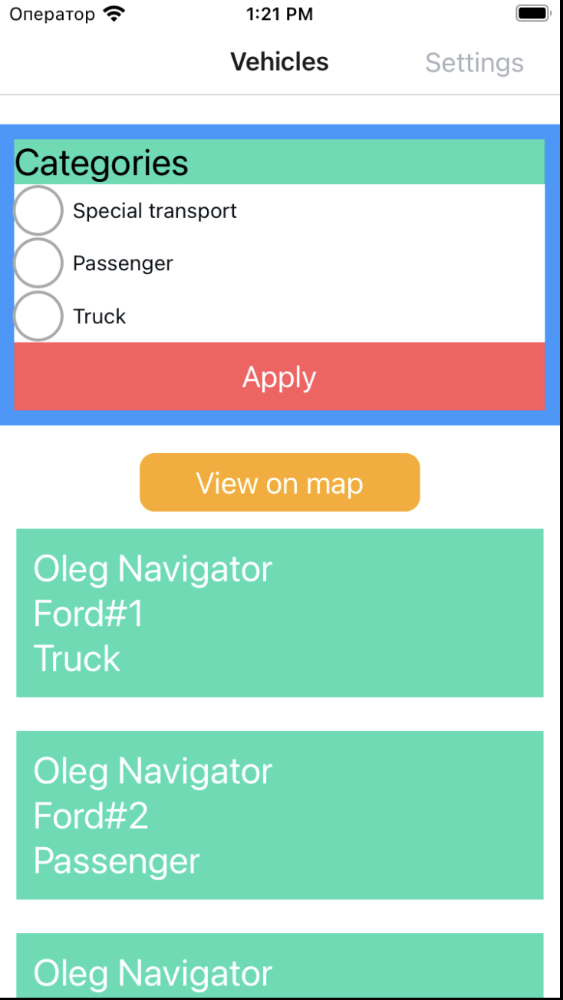
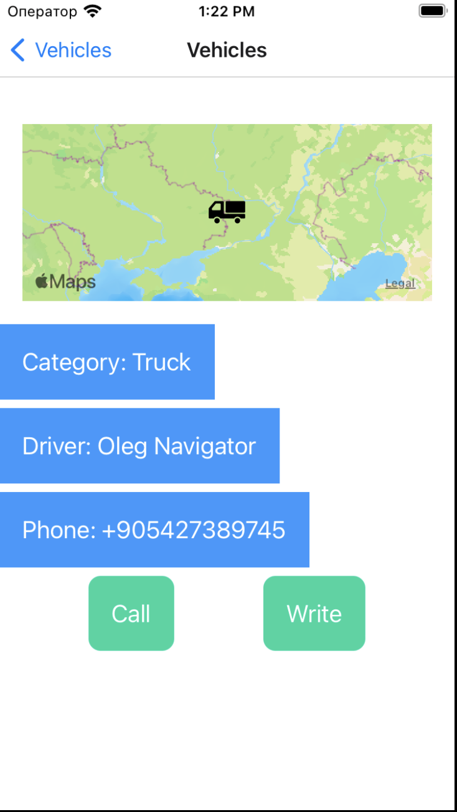
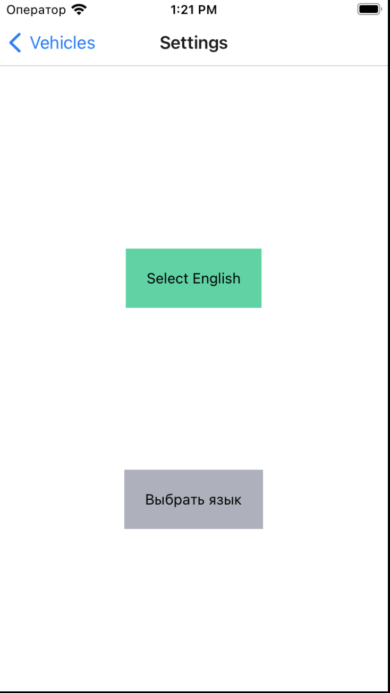

# welbex

Test react native project for WelbeX

## Running

Clone the repository and run the following commands

### iOS

`yarn ios`

### Android

`yarn android`

## Project Structure

<pre>
📁 <b>src</b> - <i>contains JS-side sources</i>
┣ 📁 <b>assets</b> - <i>contains images, translations</i>
┣ 📂 <b>components</b> - <i>contains all reusable components</i>
┃ ┗ 📜 <b>Button.tsx</b> - <i>contains the `Button` component implementation</i>
┣ 📂 <b>constants</b> - <i>contains all fixed values</i>
┣ 📂 <b>global</b> - <i>contains all reusable components</i>
┃ ┣ 📁 <b>config</b> - <i>contains files responsible for the global configuration</i>
┃ ┗ 📁 <b>styles</b> - <i>contains files responsible for the global styles</i>
┣ 📂 <b>types</b> - <i>contains types of the navigation stacks</i>
┣ 📂 <b>navigation</b> - <i>contains navigation stacks and related items</i>
┃ ┣ 📂 <b>types</b> - <i>contains types of the navigation stacks</i>
┃ ┗ 📜 <b>StackNavigation.tsx</b> - <i>root navigation stack</i>
┣ 📂 <b>screens</b> - <i>contains screen components</i>
┃ ┗ 📜 <b>Vehicle.tsx</b> - <i>contains the `Vehicle` screen implementation</i>
┗ 📂 <b>utils</b> - <i>contains utility functions</i>
</pre>

## Layouts

| Vehicles List Screen              | Vehicle Screen               | Settings Screen               |
| --------------------------------- | ---------------------------- | ----------------------------- |
|  |  |  |

#### Vehicles List Screen

- There is a `Settings` button in the header to navigate to the settings screen
- There is a category section allows you to select and filter categories by clicking on the `Apply` button
- User can switch the view by clicking on the `View list` / `View on map` button from transport information to the location of the transport on the map

#### Vehicle Screen

- There is a `Vehicles` button in the header to navigate back to the Vehicles screen
- The map shows the location of the vehicle.
- There is three sections with information about the vehicle
- The `Call` button to call the vehicle driver
- The `Write` button to write the vehicle driver in WhatsApp

#### Settings Screen

- There is a `Vehicles` button in the header to navigate back to the Vehicles screen
- The `Select English` button to set the application language to English
- The `Выбрать русский` button to set the application language to Russian
